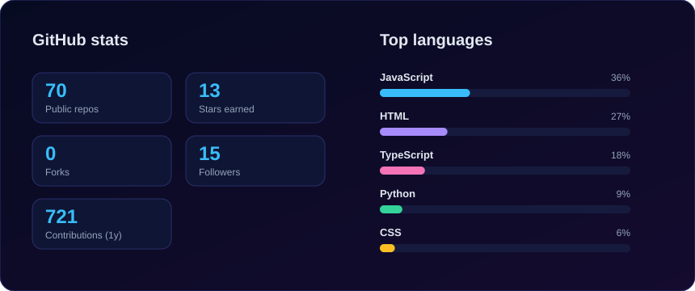
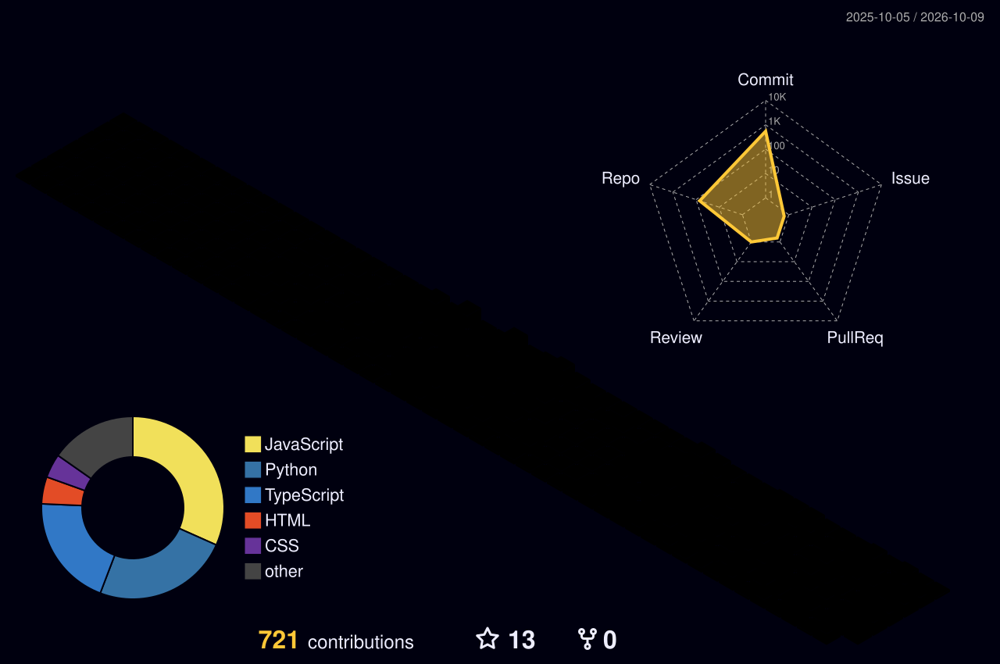

  

  
  
  
  
  

 

## Muhammad Umer Aziz - Full-Stack Developer in Lahore, Pakistan

I'm **Muhammad Umer Aziz**, a full-stack developer from Lahore, Pakistan. These days I work as a software developer at **Alkhidmat Foundation Pakistan**, building the web and mobile products behind the foundation's welfare work. Most of my time goes into **Next.js**, **React Native** and **Node.js**, and I like owning a feature end to end, from the database to the last pixel on the screen.

Outside work I'm digging into **machine learning, MLOps and system design**, mostly by building small things, breaking them, and figuring out why.

I grew up speaking Urdu and Punjabi, I work in English, and I'm picking up Japanese one kanji at a time.

**Skills:** Next.js developer, React Native developer, Node.js developer, TypeScript, MongoDB, Python, Tailwind CSS. **Based in:** Lahore, Punjab, Pakistan. **Open to:** freelance, remote and international collaboration.

If you're building something that actually matters to people and could use another developer, I'd love to hear about it. Remote and international collaboration welcome.

 

## What I work with

  

| | |
|---|---|
| **Frontend** | JavaScript, TypeScript, React, Next.js, Tailwind CSS |
| **Mobile** | React Native |
| **Backend** | Node.js, Express, Python |
| **Database** | MongoDB |
| **Everyday tools** | Git, GitHub, Linux, VS Code, Figma |

 

## Some things I've built

| Project | What it is | Stack |
|---|---|---|
| [**Bazaura.pk Web**](https://github.com/zestymec/bazaura.pk-next-js-web) | The web front for Bazaura.pk | Next.js |
| [**Bazaura App Backend**](https://github.com/zestymec/python-bazaura-app-backend) | Backend powering the Bazaura app | Python |
| [**Portfolio**](https://github.com/zestymec/portifolio) | My personal site, live at [zestymec.netlify.app](https://zestymec.netlify.app/) | Web |
| [**Weather App**](https://github.com/zestymec/weatherapp) | Look up the current weather for any city | JavaScript |
| [**To-Do List App**](https://github.com/zestymec/to-do-list-app) | A simple, no-fuss task manager | JavaScript |
| [**Coffee Machine**](https://github.com/zestymec/Coffee_machine_python) | A coffee machine simulator, one of my early Python projects | Python |

 

## My GitHub stats

  

 

## My year in 3D

  <picture>
    <source media="(prefers-color-scheme: dark)" srcset="./profile-3d-contrib/profile-night-rainbow.svg" />
    <source media="(prefers-color-scheme: light)" srcset="./profile-3d-contrib/profile-green-animate.svg" />
    
  </picture>

  <picture>
    <source media="(prefers-color-scheme: dark)" srcset="./assets/github-snake-dark.svg" />
    <source media="(prefers-color-scheme: light)" srcset="./assets/github-snake.svg" />
    
  </picture>

 

## Say hi

The quickest way to reach me is [email](mailto:m.umer394aziz@gmail.com) or a message on [LinkedIn](https://linkedin.com/in/zestymec). More of my work is on my [portfolio](https://zestymec.netlify.app/), and my notebooks and ML experiments live on [Kaggle](https://kaggle.com/zestymec).

  Thanks for stopping by. Have a good one ☕  
  

<!-- Keywords: Muhammad Umer Aziz, M Umer Aziz, zestymec, full stack developer Lahore, Next.js developer Pakistan, React Native developer Lahore, Node.js developer, software developer Alkhidmat Foundation, remote developer Pakistan -->
